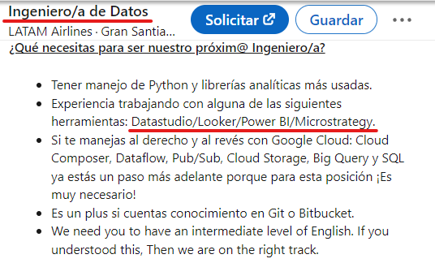
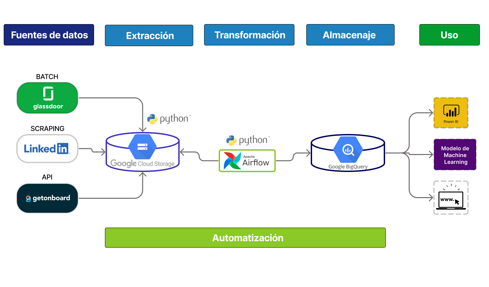

# 
***DATA WORLD: TENDENCIAS DEL MERCADO LABORAL*** 

## Proyecto Grupal

Integrantes: Melissa Contreras, Carolina Sosa, Sebastian Ezequiel, Luz Estrada y Facundo Lopez.

**Contexto:** 
 
El mercado laboral tecnológico a nivel mundial está experimentando un gran crecimiento debido al aumento de la demanda de habilidades en áreas como la inteligencia artificial, la ciberseguridad y el desarrollo de aplicaciones. Según el informe "Tendencias del empleo en tecnología" de Indeed, las búsquedas de empleo en tecnología aumentaron un 34% en todo el mundo en 2020.

La demanda en el sector de Big Data ha experimentado un crecimiento significativo en los últimos años debido al aumento de la cantidad de datos generados y al aumento de la necesidad de analizarlos para obtener información valiosa. Según un informe de IDC (International Data Corporation), el gasto mundial en tecnologías de Big Data y analítica alcanzó los 274.3 mil millones de dólares en 2022, con una tasa de crecimiento compuesto anual del 11,9% desde 2018.

A nivel de Latinoamérica el crecimiento del mercado laboral tecnológico también ha sido significativo en los últimos años, con una tasa de crecimiento del 7% anual. Específicamente en el sector de Big Data y analítica está experimentando una tasa de crecimiento del 20% anual en la región. Según un informe de la consultora de recursos humanos Michael Page.

En países como Brasil, México y Colombia, el sector tecnológico está impulsando el crecimiento económico y la creación de empleos. Además, países como Argentina y Chile cuentan con un gran talento en tecnología y están atrayendo a empresas tecnológicas extranjeras para establecerse allí.

La demanda de habilidades en Big Data está aumentando en todo el mundo, especialmente en áreas como el aprendizaje automático, la inteligencia artificial y la visualización de datos. Los profesionales con habilidades en Big Data, incluyendo científicos de datos, ingenieros de datos y analistas de datos, son altamente valorados en el mercado laboral y se espera que la demanda continúe aumentando en el futuro.

 ---
 **Problemática:**

 El campo laboral y las tendencias respecto a los perfiles y tecnologías relacionadas a big data no son muy claras debido a su acelerado crecimiento. Una empresa reclutadora tiene el gran reto de poder integrar las demandas de empresas con la oferta de profesionales que existe en el mercado. Dentro de los retos que tiene que afrontar es que muchas empresas al momento de compartir una oferta laboral tienen problemas para identificar los perfiles que serían los más adecuados a sus necesidades.

#### *Ejemplo:*
#### - Aquí observamos que a para un puesto de Ingeniero de datos, piden    saber herramientas de visualización propias del perfil de Data Analytics. 

--->--->--->--->--->--->--->--->--->--->

 

 --->--->--->--->--->--->--->--->--->--->
 
 ---
  **Solución:**

   La solución propuesta por el equipo que conformamos es brindar una herramienta para la empresa recruiter en la que pueda apoyarse para tomar mejores decisiones en base a datos(distintas métricas y KPIs) observando las tendencias del mercado laboral a nivel mundial y regional, es decir, realizar una comparativa entre ambas.

   Esta herramienta de la que hablo es un sitio web, en el cual se observará 2 áreas:
   - La primera: Los insights (trabajos más demandados, herramientas más pedidas, variaciones de sueldo por puesto o a través del tiempo,etc)

   - La segunda: Un filtro en el que el recruiter podrá saber a que perfil pertenece el postulante en base a las herramientas tecnológicas que maneja, o viceversa, si sabe qué herramientas necesita buscar, saber qué puesto de trabajo está buscando publicar.
   Este filtro será posible gracias a un modelo de machine learning de clasificación no supervisado.

 ---

## Nuestra Camino

La metodología Scrum es un proceso para llevar a cabo un conjunto de tareas de forma regular con el objetivo principal de trabajar de manera colaborativa, es decir, para fomentar el trabajo en equipo.

Con este método de trabajo lo que se pretende es alcanzar el mejor resultado de un proyecto determinado. Las prácticas que se aplican con la metodología Scrum se retroalimentan unas con otras y la integración de las mismas tiene su origen en un estudio de cómo hay que coordinar a los equipos para ser potencialmente competitivos.

En Scrum se van realizando entregas regulares y parciales del trabajo final, de manera prioritaria y en función del beneficio que aportan dichas entregas a los receptores del proyecto. Por este motivo, es una metodología especialmente indicada para proyectos complejos, con requisitos cambiantes y en los que la innovación y la flexibilidad son protagonistas.

--->--->--->--->--->--->--->--->--->--->

## **Pipeline**

## Nuestro Hallazgos
En el análisis de los datos obtenidos, se trató de identificar las necesidades de información de la reclutadora. Teniendo en cuenta que el objetivo es estar al pendiente de las tendencias del mercado en torno a los 3 perfiles laborales definidos (analyst, engineer, scientist), se construyeron métricas que van alineados a tres líneas claramente marcadas. Estas fueron: 1) Conocer el estado de los sueldos y tendencias en el mercado, 2) Identificar las ofertas laborales a nivel mundial y su comparación con Sudamérica, e 3) Identificar los requerimientos de las herramientas por perfil que actualmente el mercado está definiendo. 

En la siguiente imagen se muestra cómo es el estado del mercado de sueldos. El KPI definido fue la _variación de los sueldos de forma trimestral por año_

 

 

 

métricas
 KPIs
 
 ## Modelo Machine learning
 
  ## Video
 

  ## Link de deployment

 
